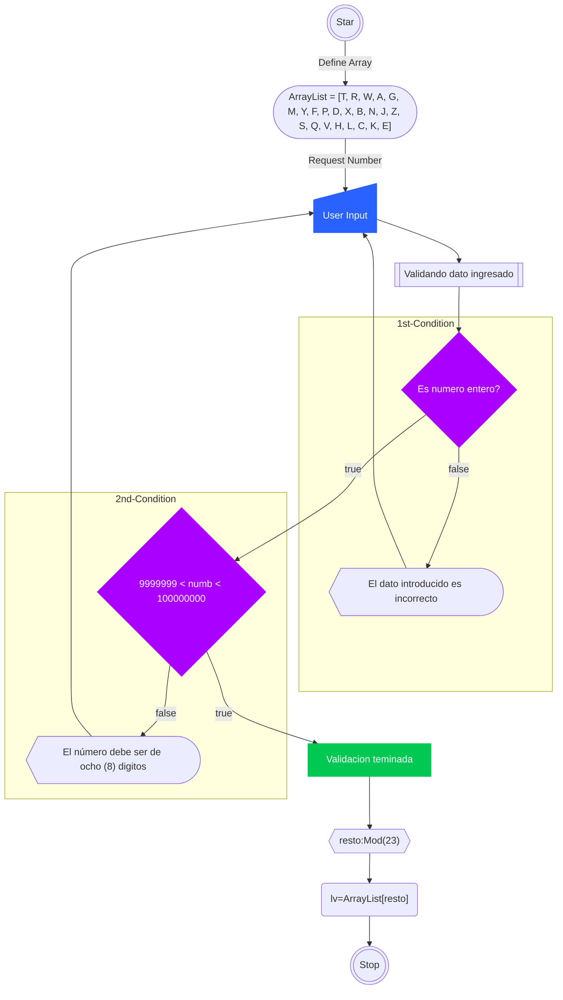

# My_JPKATADNI

## Diagrama de Flujo

```mermaid
flowchart TB
%% Nodes
    A(((Star)))
    B(["ArrayList = [T, R, W, A, G, M, Y, F, P, D, X, B, N, J, Z, S, Q, V, H, L, C, K, E]"])
    C@{ shape: manual-input, label: "User Input" }
    c@{shape: subproc, label: "Validando dato ingresado"}
    D@{shape: diamond, label: "Es numero entero?"}
    d@{shape: curv-trap, label: "El dato introducido es incorrecto"}
    E@{shape: diamond, label: 9999999 < numb < 100000000 }
    e@{shape: curv-trap, label: "El número debe ser de ocho (8) digitos"}
    F@{ shape: rect, label: "Validacion teminada"}
    G@{ shape: hex, label: "resto:Mod(23)"}
    H@{ shape: rounded, label: "lv=ArrayList[resto]" }
    I@{shape: dbl-circ, label: "Stop"}


%% Edge connections between nodes
    A -- Define Array --> B 
    B -- Request Number --> C 
    C --> c --> D 
    subgraph 1st-Condition 
    D -- false --> d
    end
    D -- true --> E
    subgraph 2nd-Condition 
    E -- false --> e
    end
    d --> C
    e --> C
    E -- true --> F
    F --> G --> H --> I


%% Individual node styling. Try the visual editor toolbar for easier styling!
    style C color:#FFFFFF, stroke:#2962FF, fill:#2962FF
    style D color:#FFFFFF, fill:#AA00FF, stroke:#AA00FF
    style E color:#FFFFFF, fill:#AA00FF, stroke:#AA00FF
    style F color:#FFFFFF, stroke:#00C853, fill:#00C853

```